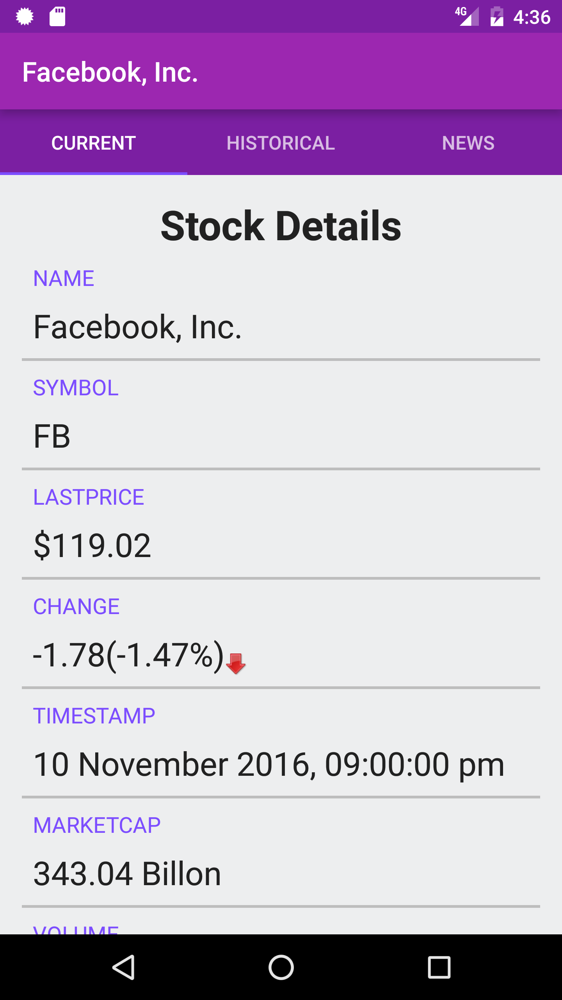
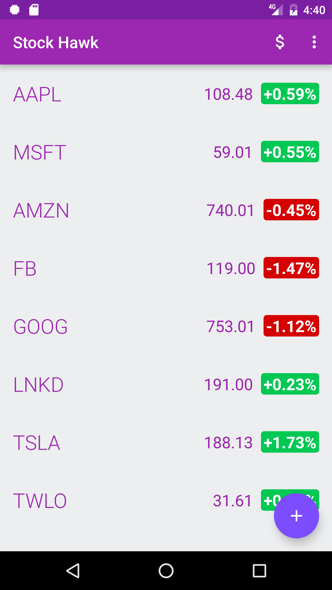
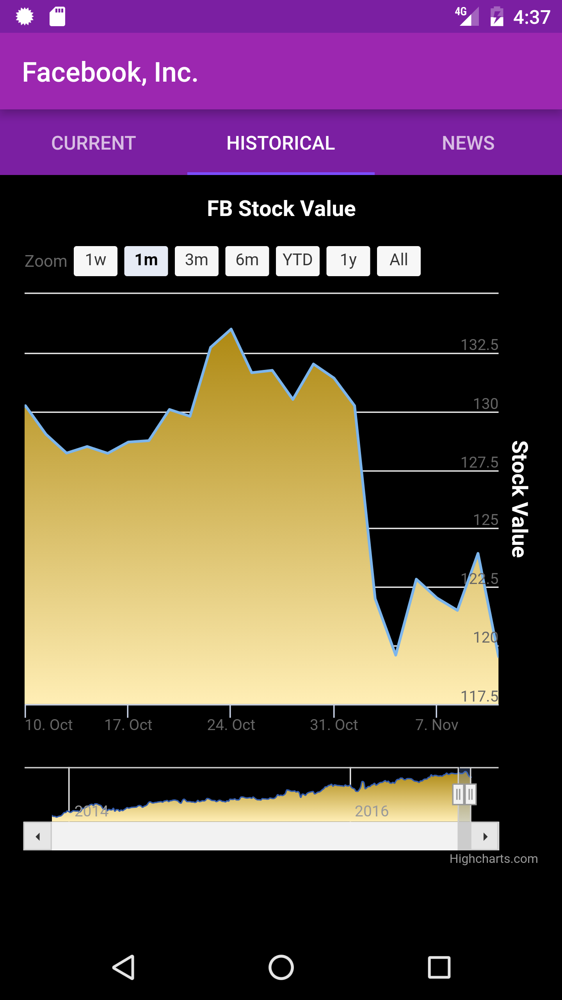

# Stock-Hawk
Project 3 for Udacity's Android Nano-Degreee.

Taking a stocks app from a functional state to a production-ready state

## Features
The following **required** functionality is completed
- [x] Each stock is clickable and displays a graph of the stock’s value over time
- [x] App does not crash when a user searches for a non-existent stock
- [x] Stocks can be displayed in a collection widget.
- [x] App has content descriptions for all buttons
- [x] App supports layout mirroring for RTL layouts
- [x] Error message displayed when user is offline, or list is empty or out of date.

The following **optional** features are implemented
- [x] User sees loading state while waiting for the data from API.
- [x] Each stock displays a stock details and company-related news articles

## Screenshots
Single Stock Detailed View                                                       |  Stocks Main Page
:-------------------------------------------------------------------------------:|:--------------------------------------------------------------------------------:
 |  


Stock News Feed                                                                  |  Stock Chart
:-------------------------------------------------------------------------------:|:--------------------------------------------------------------------------------:
 |  

## Libraries Used

###View Binding
[ButterKnife](https://jakewharton.github.io/butterknife/)

###API Requests
[Retrofit](https://square.github.io/retrofit/)

## License
```
Copyright [2016] [Victor Akap Oben]

Licensed under the Apache License, Version 2.0 (the "License");
you may not use this file except in compliance with the License.
You may obtain a copy of the License at

    http://www.apache.org/licenses/LICENSE-2.0

Unless required by applicable law or agreed to in writing, software
distributed under the License is distributed on an "AS IS" BASIS,
WITHOUT WARRANTIES OR CONDITIONS OF ANY KIND, either express or implied.
See the License for the specific language governing permissions and
limitations under the License.
```
